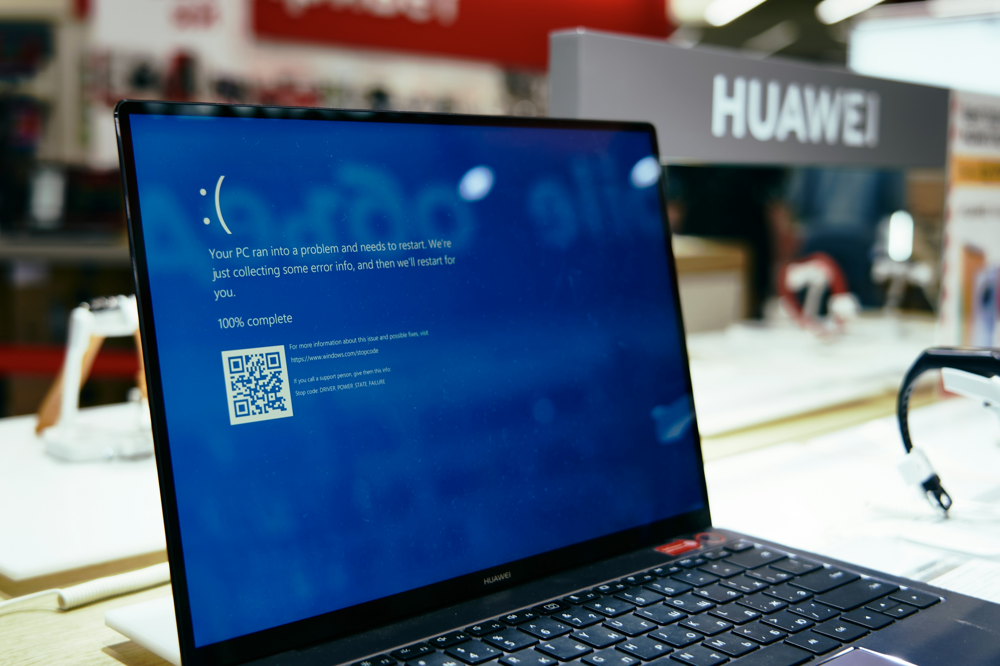

Proudly I present to you the new MarcelVenema.com website, as a successor of my old W-TECH.NET site. 

The MarcelVenema.com website will act as my personal website, with hopefully lots of information, blogs and other useful stuff for my fellow friends and colleagues. Unfortunately still the old stress again, a week before presenting at the RES Software RSVP meeting the old site went blue…. 

Blue like the famous blue screen of death (BSOD) and I could not restore the virtual server or website it in any way. So if you look around and notice some empty whitespaces, you are right. Instead of spending Christmas with the family I will be updating my site.

Feel free to send comments, questions and remarks to marcel@marcelvenema.com Thank you for visiting my site!

&nbsp;  
&nbsp;  

---

Photo by <a href="https://unsplash.com/@skabrera?utm_content=creditCopyText&utm_medium=referral&utm_source=unsplash">Sergi Kabrera</a> on <a href="https://unsplash.com/photos/white-computer-keyboard-2xU7rYxsTiM?utm_content=creditCopyText&utm_medium=referral&utm_source=unsplash">Unsplash</a>

Photo by <a href="https://unsplash.com/@shaikhulud?utm_content=creditCopyText&utm_medium=referral&utm_source=unsplash">Maxim Tolchinskiy</a> on <a href="https://unsplash.com/photos/black-laptop-computer-on-white-table-SA-gNINw0Q4?utm_content=creditCopyText&utm_medium=referral&utm_source=unsplash">Unsplash</a>

&nbsp;
    