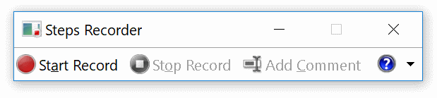

I am very surprised how many people don’t know this fantastic small tool. It is standard Windows functionality since Windows 7 and if you need to report a bug or document installation or configuration steps, this tool is a ‘must-have’. I am talking about the (Problem) Steps Recorder, **PSR.EXE**

I use it a lot for documenting installations or quickly record where a program goes wrong. Search for steps recorder or PSR.EXE on your Windows machine and click on ‘Start Record’. PSR.EXE behaves like a screen casting tool, but instead of megabytes full screen video, every click or action a screenshot is made.

The user can save the document as a ZIP file and e-mail it to the support department. Actually it is a compressed MHTML document.

When you are a sequencer/packager, this should be your standard tool for documenting installations and configurations.
Do you agree ?

&nbsp;  
&nbsp;  

---

Photo by <a href="https://unsplash.com/@stecman?utm_content=creditCopyText&utm_medium=referral&utm_source=unsplash">Stephen Holdaway</a> on <a href="https://unsplash.com/photos/black-cassette-tape-on-white-textile-Wa6za80_R_k?utm_content=creditCopyText&utm_medium=referral&utm_source=unsplash">Unsplash</a>

&nbsp;
