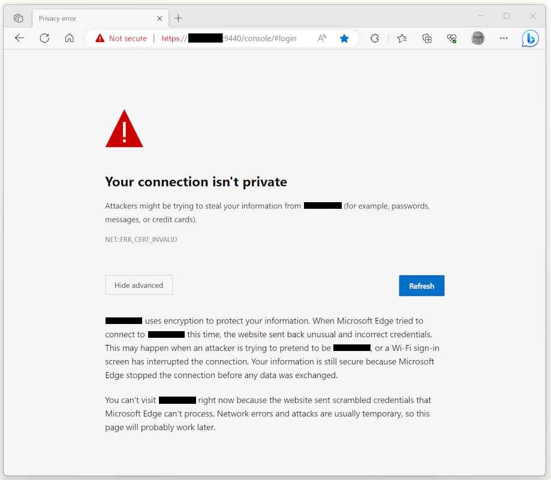
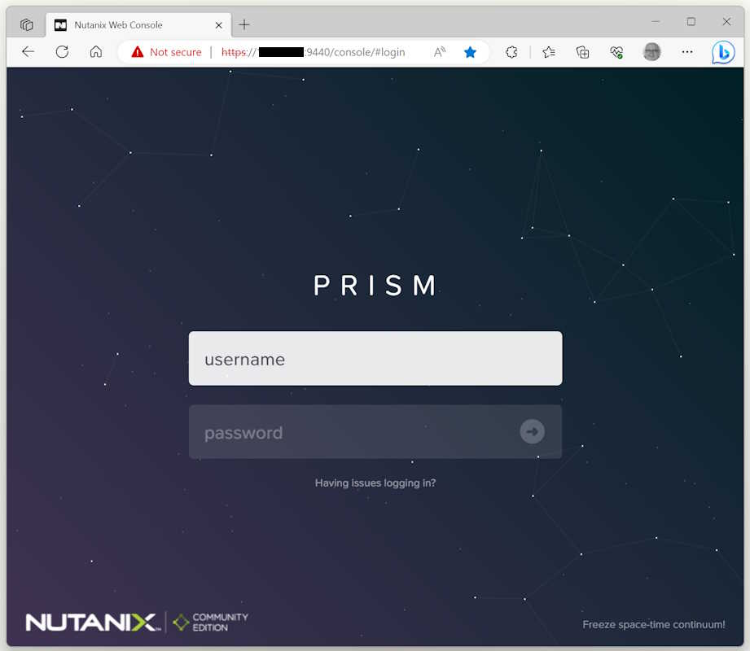

If you get an SSL/TLS error when accessing the Nutanix Prism Elements or  Prism Central web console, there is a good chance you updated your Chromium-based browser recently.

<!--more-->

If a browser like Microsoft Edge, Google Chrome, or other Chromium-based browsers encounters an issue with the SSL/TLS certificate of a website, it displays a warning page indicating that the connection is not private, and your data may be at risk. Previously, it provides an option to go back to safety or view advanced options, but after the recent security updates, you get an error message like NET::ERR_CERT_INVALID

You can bypass the message by typing 'thisisunsafe' and enter in the GUI of the browser. 

The 'thisisunsafe' message is a bypass mechanism that Chrome provides as a hidden feature. It allows advanced users or developers to proceed to the website despite the SSL/TLS certificate error. By typing 'thisisunsafe' on the warning page and pressing Enter, Chrome disregards the certificate error and loads the website.

It's important to note that using the 'thisisunsafe' bypass is not recommended for regular users, as it can expose your data to potential security risks. SSL/TLS certificate errors usually indicate that the website's certificate is either invalid, expired, self-signed, or issued by an untrusted authority. In such cases, it's better to avoid accessing the website until the certificate issue is resolved, or contact the website administrator to ensure the security of the connection.

To fix this error permanently you need to import a trusted certificate into the Nutanix Prism web console and access it via the matching FQDN of the common name of the certificate. You can import the certificate via Settings - Security - SSL Certificate.

If you encounter an SSL/TLS certificate error while trying to access a website, it's a good idea to verify the website's authenticity and ensure that you are not transmitting sensitive information on an insecure connection. If you are a website owner, make sure your SSL/TLS certificate is valid and properly configured to avoid these errors for your users.   

&nbsp;  

Photo by <a href="https://unsplash.com/@firmbee?utm_content=creditCopyText&utm_medium=referral&utm_source=unsplash">Firmbee.com</a> on <a href="https://unsplash.com/photos/person-using-black-laptop-computer-eMemmpUojlw?utm_content=creditCopyText&utm_medium=referral&utm_source=unsplash">Unsplash</a>
  
&nbsp;  
